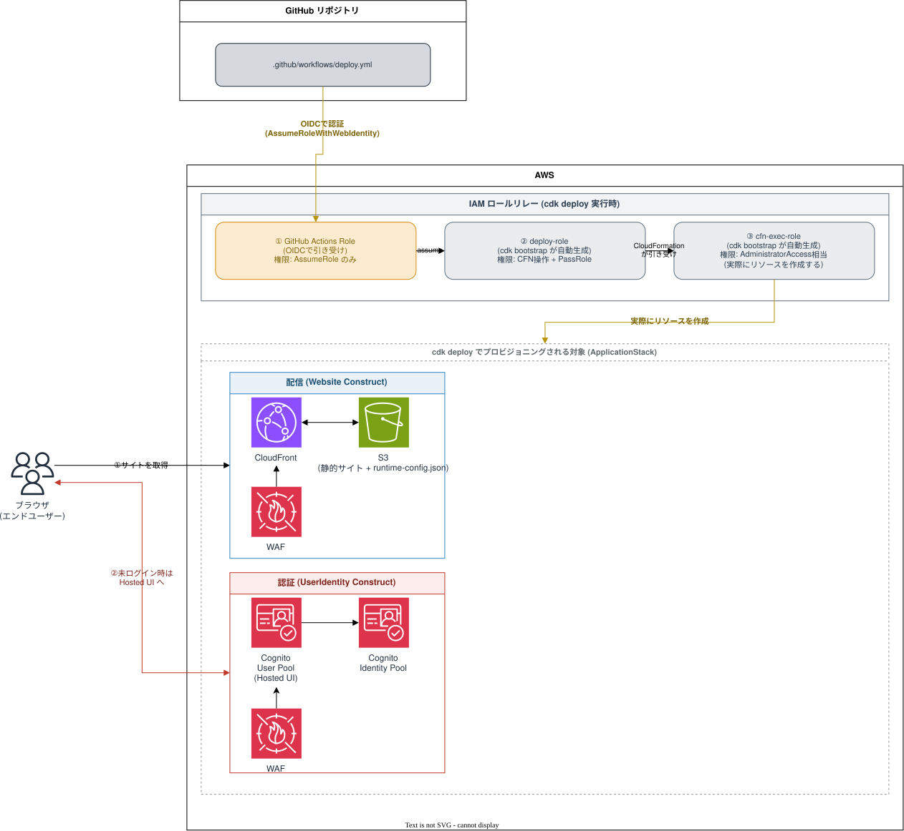

# nx-plugin-aws-sample

`@aws/nx-plugin` を使って、React + Cognito認証 + CDKデプロイを一式そろえたNxモノレポのサンプル。GitHub Actions から OIDC 経由で AWS にデプロイする CI/CD 込み。

## 思想

- **インフラもアプリケーションコードと同じリポジトリ・同じレビューフローで管理する**（IaC + Nx モノレポ）
- **「初期構築」と「日々のデプロイ」で権限を分ける**: CDK Bootstrap のような広い権限（IAM/S3/ECR 等）が要る作業は人がローカルで最初に1回だけ行い、日常のデプロイは GitHub Actions の狭い権限の Role に任せる（最小権限の原則）
- **`main` ブランチの状態が「今デプロイされているべき状態」の正**: GitHub Actions による自動デプロイを正規のデプロイ経路とし、ローカルからの `deploy-sandbox` はあくまで個人の動作確認用であって、本番相当の変更を流し込む経路にはしない
- **ビルド時設定とデプロイ時設定を分離する**: Cognito の User Pool ID などデプロイして初めて確定する値はビルド時に埋め込まず、`runtime-config.json` として実行時にフロントへ注入する
- **認証・配信のような繰り返し使うインフラは Construct として切り出す**: `UserIdentity` / `Website` を `packages/common/constructs` に切り出し、他のスタックからも再利用できるようにする

## 全体構成図



編集する場合は [img/architecture.drawio](img/architecture.drawio) を [draw.io](https://app.diagrams.net/) で開く。

- `packages/website`（React）と `packages/infra`（CDK）を含む Nx モノレポで管理
- `packages/common/constructs` の `UserIdentity` / `Website` Construct を `infra` から利用してデプロイ
- デプロイ先は CloudFront + S3 の静的サイトホスティングと、Cognito（User Pool / Identity Pool、Hosted UI）
- WAF は CloudFront 用と User Pool 用でそれぞれ個別（scope が異なる）に作成される
- フロントエンドは `runtime-config.json` 経由でデプロイ後の Cognito の値を受け取り、未ログイン時は Hosted UI にリダイレクトする
- GitHub Actions は OIDC で①専用 Role を引き受け、`cdk bootstrap` が作った②③の Role にリレーしてデプロイする

## リポジトリ構成

```text
├─ packages/
│  ├─ website/                React サイト
│  ├─ infra/                  CDK アプリケーション
│  └─ common/
│     ├─ constructs/          共有 CDK Construct（UserIdentity, Website など）
│     └─ shadcn/              共有 UI コンポーネント
├─ img/
│  └─ architecture.drawio     全体構成図
└─ .github/workflows/
   └─ deploy.yml              GitHub Actions によるデプロイワークフロー
```

> リポジトリ直下には他に、各種 AI コーディングエージェント（Claude Code / Cursor / Codex / Gemini / Kiro / VSCode）向けの MCP サーバー設定（`.mcp.json` など）もある。すべて `@aws/nx-plugin-mcp` を登録するだけの設定で、使わないツールのものは削除しても動作に影響しない。

## 構築手順

GitHub Actions から OIDC 経由で AWS にデプロイできるようにするための、初回だけ必要な手順。すべて広い権限が要る作業なので、人がコンソール／CloudShell から行う（CI の Role には持たせない）。

### 1. GitHub の OIDC Provider を AWS に登録する

IAM コンソール → 「IDプロバイダ」→「プロバイダを追加」

- タイプ: OpenID Connect
- プロバイダの URL: `https://token.actions.githubusercontent.com`（「サムプリントを取得」で自動取得）
- 対象者（Audience）: `sts.amazonaws.com`

CLI で確認する場合:

```sh
aws iam list-open-id-connect-providers
```

### 2. GitHub Actions 用の IAM Role を作成する

信頼ポリシー（このリポジトリのワークフローだけ Assume を許可する）:

```json
{
  "Version": "2012-10-17",
  "Statement": [
    {
      "Effect": "Allow",
      "Principal": {
        "Federated": "arn:aws:iam::<アカウントID>:oidc-provider/token.actions.githubusercontent.com"
      },
      "Action": "sts:AssumeRoleWithWebIdentity",
      "Condition": {
        "StringEquals": {
          "token.actions.githubusercontent.com:aud": "sts.amazonaws.com"
        },
        "StringLike": {
          "token.actions.githubusercontent.com:sub": "repo:<owner>/<repo>:*"
        }
      }
    }
  ]
}
```

> **注意**: アカウント／リポジトリによっては、実際のトークンの `sub` が `repo:<owner>/<repo>:*` ではなく `repo:<owner>@<ownerId>/<repo>@<repoId>:*`（不変の数値IDを含む形式）になっていることがある。信頼ポリシーが正しいはずなのに `Not authorized to perform sts:AssumeRoleWithWebIdentity` になる場合は、下記トラブルシューティングを参照。

権限ポリシー（`cdk bootstrap` が作った Role を Assume できるだけの薄い権限）:

```json
{
  "Version": "2012-10-17",
  "Statement": [
    {
      "Effect": "Allow",
      "Action": "sts:AssumeRole",
      "Resource": "arn:aws:iam::<アカウントID>:role/cdk-*"
    }
  ]
}
```

### 3. Role の ARN を GitHub Secrets に登録する

GitHub リポジトリの `Settings → Secrets and variables → Actions` で `AWS_DEPLOY_ROLE_ARN` として登録する。

### 4. CDK Bootstrap を実行する

アカウント×リージョンごとに初回1回。**`.github/workflows/deploy.yml` の `aws-region` / `CDK_DEFAULT_REGION` と同じリージョンを指定すること**（bootstrap したリージョンと deploy 先のリージョンがずれていると、bootstrap 用の Role が見つからずデプロイが失敗する）。

```sh
npx aws-cdk@latest bootstrap aws://<アカウントID>/<リージョン>
```

<details>
<summary>トラブルシューティング: <code>Not authorized to perform sts:AssumeRoleWithWebIdentity</code></summary>

信頼ポリシー・OIDC Provider・Secret の値が全部正しく見えるのに解決しない場合、ワークフローに以下のデバッグ用ステップを一時的に追加して、実際に発行されているトークンの中身（`sub`・`aud` など）を直接確認するのが早い。

```yaml
- name: Debug OIDC token claims
  run: |
    IDTOKEN=$(curl -sSL -H "Authorization: bearer $ACTIONS_ID_TOKEN_REQUEST_TOKEN" "${ACTIONS_ID_TOKEN_REQUEST_URL}&audience=sts.amazonaws.com" | jq -r '.value')
    PAYLOAD=$(echo "$IDTOKEN" | cut -d. -f2 | tr '_-' '/+')
    case $(( ${#PAYLOAD} % 4 )) in
      2) PAYLOAD="${PAYLOAD}==" ;;
      3) PAYLOAD="${PAYLOAD}=" ;;
    esac
    echo "$PAYLOAD" | base64 -d | jq .
```

JWT のペイロードは base64url（`+`/`/` の代わりに `-`/`_`、パディング省略）なので、素の `base64 -d` では正しくデコードできない点に注意。出力された `sub` と信頼ポリシーの条件を突き合わせれば原因が特定できる。

</details>

## デプロイ

正規のデプロイ経路は GitHub Actions。[`.github/workflows/deploy.yml`](.github/workflows/deploy.yml) を GitHub の Actions 画面から手動実行（`workflow_dispatch`）すると、`npx nx run infra:deploy-sandbox` が実行される。AWS への認証は OIDC 経由（GitHub Actions Role を Assume）で行う。push トリガーは意図せぬデプロイを避けるため設定していない。

ローカルから直接動作確認したい場合:

```sh
npx nx run infra:deploy-sandbox
```

## 削除手順

「構築手順」で作ったものは CDK 管理外（手動で作成した AWS リソース）なので、`cdk destroy` だけでは消えない。全部やめる場合は以下を逆順に実施する。

### 1. アプリのスタックを削除する

> **事前準備が必要**: `UserIdentity` の User Pool は `deletionProtection: true` になっているため、**このままではスタック削除が失敗する**。先に Cognito コンソールで対象の User Pool を開き、削除保護を無効化するか、CLI で以下を実行する。
>
> ```sh
> aws cognito-idp update-user-pool --user-pool-id <UserPoolId> --deletion-protection INACTIVE
> ```

```sh
npx nx run infra:destroy-sandbox
```

CloudFormation コンソールから直接スタックを削除しても良いが、その場合は**削除の順番に注意**（`Application` スタックが WAF スタックの ARN を参照して依存しているため、先に `*-Application` を消してから `*-ApplicationWebsitewaf...` を消す）。S3 バケットは `autoDeleteObjects: true` になっているため、中身が残っていても自動で空にしてから削除される。

<details>
<summary>削除後も残るもの（別途手動で消す必要がある）</summary>

- **KMS カスタマーマネージドキー（2つ）**: `WebsiteKey`（S3バケット暗号化用）と `WebAclLogsKey`（WAFログ暗号化用）。CDKの `Key` construct はデフォルトで `RemovalPolicy.RETAIN` のため、スタックを消してもキー自体は残り、$1/月ずつ課金され続ける。**KMSコンソール**から「キーのスケジュール削除」（最短7日後）を行う
- **Lambda 由来の CloudWatch Logs ロググループ**: `BucketDeployment` や `CrossRegionExportWriter/Reader` が使う自動生成 Lambda 関数のログ（`/aws/lambda/...`）。Lambda サービスが初回実行時に自動作成するもので CloudFormation スタックの管理下になく、スタック削除では消えない。CloudWatch コンソールで手動削除するか放置してよい（ストレージ量が小さければ課金影響はごく僅か）

</details>

### 2. GitHub Secrets を削除する（任意）

GitHub リポジトリの `Settings → Secrets and variables → Actions` で `AWS_DEPLOY_ROLE_ARN` を削除する。

### 3. GitHub Actions 用の IAM Role を削除する

```sh
aws iam delete-role-policy --role-name <ロール名> --policy-name cdk-assume
aws iam delete-role --role-name <ロール名>
```

### 4. OIDC Provider を削除する（他のリポジトリ／Roleで使っていない場合のみ）

```sh
aws iam delete-open-id-connect-provider \
  --open-id-connect-provider-arn arn:aws:iam::<アカウントID>:oidc-provider/token.actions.githubusercontent.com
```

### 5. CDK Bootstrap スタック（CDKToolkit）を削除する（任意）

同じアカウント×リージョンで他の CDK プロジェクトも動かす予定がなければ削除できる。S3 バケットに何か残っていると失敗するので、その場合は中身を空にしてから再実行する。

```sh
aws cloudformation delete-stack --stack-name CDKToolkit --region <リージョン>
```

> **課金の注意**: WAF Web ACL（CloudFront 用・User Pool 用の2つ、各 $5/月 + ルール分）と KMS カスタマーマネージドキー（2つ、各 $1/月）は、トラフィックが無くても月$15前後の固定費が発生し続ける。検証が終わったら早めに手順1を実施すること。

<details>
<summary>削除できているかの確認コマンド</summary>

```sh
# アカウント固有の値を先に定義する
REGION=<リージョン>
ROLE_NAME=<ロール名>

# CloudFormationスタックが残っていないか
aws cloudformation list-stacks \
  --region "$REGION" \
  --stack-status-filter CREATE_COMPLETE UPDATE_COMPLETE ROLLBACK_COMPLETE DELETE_FAILED \
  --query "StackSummaries[?contains(StackName, 'nx-sample') || StackName=='CDKToolkit'].{Name:StackName,Status:StackStatus}" \
  --output table

# KMSキーが残っていないか(スケジュール削除済みかどうかも含めて確認)
aws kms list-keys --region "$REGION" --query 'Keys[].KeyId' --output text | tr '\t' '\n' | \
  xargs -I{} aws kms describe-key --region "$REGION" --key-id {} \
  --query 'KeyMetadata.{Id:KeyId,State:KeyState,Description:Description}' --output table

# S3バケットが残っていないか(アプリ用・CDK bootstrap用の両方)
aws s3 ls | grep -iE 'nx-sample|cdk-hnb659fds'

# Cognito User Poolが残っていないか
aws cognito-idp list-user-pools --region "$REGION" --max-results 20 \
  --query "UserPools[?contains(Name, 'UserPool')].{Id:Id,Name:Name}" --output table

# IAM Roleが残っていないか
aws iam get-role --role-name "$ROLE_NAME" 2>&1 | head -3

# OIDC Providerが残っていないか(消していなければ残っているのが正常)
aws iam list-open-id-connect-providers

# CloudWatch Logsに残骸が無いか(Lambda由来のもの含む)
aws logs describe-log-groups --region "$REGION" \
  --query "logGroups[?contains(logGroupName, 'nx-sample') || contains(logGroupName, 'Website') || contains(logGroupName, 'UserIdentity')].logGroupName" \
  --output table
```

KMSキーは`State`が`PendingDeletion`になっていればOK、`Enabled`のままなら消し忘れ。

</details>

## このリポジトリの作成手順（再現用）

1. Node.js をインストール（未導入の場合）

   ```sh
   brew install node
   ```

2. Nx ワークスペースを作成する。ディレクトリ名が数字始まりだと `create-nx-workspace` に弾かれるため、ワークスペース名は別途 `--name` で指定し、`--directory=.` でカレントディレクトリに展開する。

   ```sh
   npx create-nx-workspace@latest <workspace-name> --directory=. --preset=@aws/nx-plugin --nxCloud=skip
   ```

   実行環境によっては、この内部で呼ばれる `@aws/nx-plugin:preset` ジェネレータの実行だけが失敗することがある（`create-nx-workspace` 自体は成功し、`package.json` 等の雛形は作られる）。その場合は同じ内容を手動で再実行すればよい。

   ```sh
   npx nx g @aws/nx-plugin:preset --quiet --no-interactive \
     --directory=. --preset=@aws/nx-plugin --ci=skip \
     --no-trustThirdPartyPreset --skipGitHubPush --name=<workspace-name> \
     --no-useProjectJson --no-skipCloudConnect --no-neverConnectToCloud \
     --packageManager=npm --defaultBase=main --aiAgents=claude --no-analytics
   ```

3. CDK インフラプロジェクトを生成する。

   ```sh
   npx nx g @aws/nx-plugin:ts#infra --name=infra --no-interactive
   ```

4. React サイトを生成する。

   ```sh
   npx nx g @aws/nx-plugin:ts#react-website --name=website --no-interactive
   ```

5. サイトに Cognito 認証を追加する。

   ```sh
   npx nx g @aws/nx-plugin:ts#react-website#auth --project=website --no-interactive
   ```

6. `packages/infra/src/stacks/application-stack.ts` に `UserIdentity` / `Website` を手動で配線する。ジェネレータは Construct を作るところまでで、スタックへの組み込みは自動化されていない。

   ```ts
   import { UserIdentity, Website } from '@<workspace-name>/common-constructs';

   export class ApplicationStack extends Stack {
     constructor(scope: Construct, id: string, props?: StackProps) {
       super(scope, id, props);

       new UserIdentity(this, 'UserIdentity');
       new Website(this, 'Website');
     }
   }
   ```

7. TypeScript のプロジェクト参照を同期する。

   ```sh
   npx nx sync
   ```

8. ビルドが通ることを確認する。

   ```sh
   npx nx run infra:build
   ```

9. `.github/workflows/deploy.yml` と `img/architecture.drawio` はジェネレータには含まれないため、手動で作成する。

`@aws/nx-plugin` には上記以外にも多数のジェネレータ（API・DB・MCPサーバー・AIエージェントなど）が用意されている。一覧は `npx nx list @aws/nx-plugin` か、[公式ドキュメント](https://awslabs.github.io/nx-plugin-for-aws)を参照。

## 参考リンク

- [@aws/nx-plugin クイックスタート](https://awslabs.github.io/nx-plugin-for-aws/en/get_started/quick-start/)
- [Nx でのタスク実行について](https://nx.dev/features/run-tasks)
- [Nx sync（TypeScript プロジェクト参照の自動同期）について](https://nx.dev/reference/nx-commands#sync)


# 余談。なぜAWSはこのフレームワークを作ったのか？考察

## 設計思想: 決定的な土台と、AIの役割分担

> **AIに書かせるな、構造に書かせろ。**

### 背景

- AIは数分でアプリを立ち上げられるが、本番品質に届くまでのレビュー・修正・テストの往復は減らない
- 品質をAIの「頑張り」に委ねている限り、結果は毎回ぶれる
- ならば、良い結果が**必然的に**出る構造を先に置く

### 原則

- **土台は決定的に生成する**
  - 同じ入力から、毎回同じ土台ができる
  - セキュリティ・可観測性・再現性といった「譲れない要件」は、ここに閉じ込める
- **生成物は自分のものにする**
  - 生成されたコードは、生成後は通常のコードとして自由に編集できる
  - 特定のツールへの実行時依存を持ち込まない
- **改善は後から届く**
  - 土台に加えた改善は、既存のサービスにも適用できる状態を保つ
  - 「所有」と「更新」を両立する
- **AIは"選ぶ側"に回る**
  - AIは土台を書くのではなく、用意された部品を選び、組み合わせる
  - AIの自由度を絞るほど、出力は安定し、速くなる

### 期待する効果

- レビューで人が見る対象を、「土台」ではなく「差分のロジック」だけに絞れる
- 新しいサービスを、思想から外れずに素早く立ち上げられる
- 技術選定はサービスごとに自由なまま、品質の下限は揃う

### 着想

- AWS PACEチームの「Nx Plugin for AWS」
  - テンプレート → ライブラリ → ジェネレーターと試行を重ね、「コードは所有させ、改善はマイグレーションで届ける」形に至った
  - https://aws.amazon.com/jp/blogs/news/build-full-stack-aws-applications-in-minutes-with-ai-powered-scaffolding/

### ステータス

- 現時点では**構想段階**であり、思想の言語化のみ
- 最初の一歩は「土台を決定的に生成できるようにすること」

> **自由度を捨てた場所にだけ、本当の自由が生まれる。**
